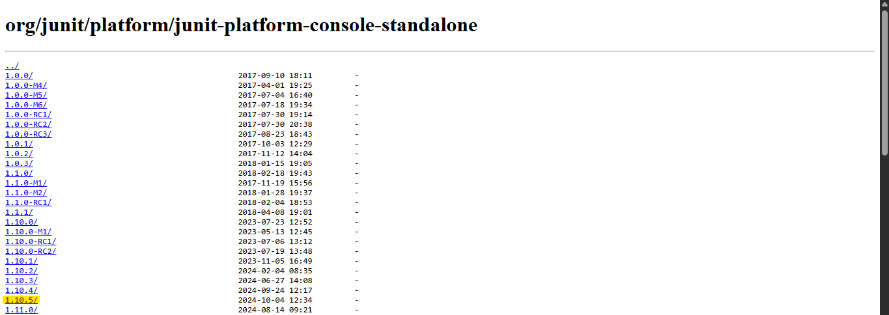

# ECM2414 Software Development – How to run the test suite

## Overview
This file intent to explains **how to compile and run the JUnit 5 tests for the multi-threaded card game.** 

Basically, the test verify that the program behaves in a correct way and following the specifications:
- Card and CarDeck functionality (thread-safety container (FIFO order))
- Player behaviour (Winning hand, atomic draw/discard logic)
- Overall CardGame execution (valid/ivalid pack handling, file outputs, console messages)

---

## Requirements

| Component            | Detail                                                               |
|----------------------|----------------------------------------------------------------------|
| Java Development Kit | 17 or newer                                                          |
| JUnit 5              | Stand-alone launcher: *junit-platform-console-standalone-1.10.x.jar* |
| Operationg system    | Any system with command line                                         |

For the standalone JAR it can be use the one from Maven Central (get it through the next URL): https://repo1.maven.org/maven2/org/junit/platform/junit-platform-console-standalone/
 1. First when opening the URL, it will redirected to a screen like this (the project used the ../1.10.5 but it can be used any ../1.10.x): 
 
 2. Then to finally install the Stand-alone launcher, click the following link, the install will stat inmediatelly:
 
 3. Finally place it inside a folder named lib/ eg:
 ECM2414-CardGame/
│
├── src/..
│
├── test/cardgame/..
**├── lib/junit-platform-console-standalone-1.10.5.jar**
│
├── docs/..
│
├── output/..
├── build/..
├── scripts/..
│
├── README.md
└── .gitignore

## Running Test (Command line)

1. Compile
It is recomended to compile both, the production and the test classes into a separate build directory (must be inside the correct path --..\ECM2414-CARD-GAME-- to execute the command):
```java
 javac -d build ^ -cp lib/junit-platform-console-standalone-1.10.5.jar ^ \src\main\java\cardgame\*.java test\cardgame\*.java
```

2. Run
This command lines expects to launch the JUnit Framework console and then expects to show if the tests passed or failed.
 ```java
 java -jar lib/junit-platform-console-standalone-1.10.5.jar ^
 ```

## Running test (IDE eg: VS code)
1. Requierements
To run the test in VS code is necessary to have the extention "Test Runner for Java" by Microsoft:

2. Create settings file
If VS code is being used, press "Ctrl+Shift+P" and that should open the command palette, then write "Java: Configure Classpath", after opened this the library will need to be added manually, and the result should looks like this:

3. setting.json
After completing the step above, it will automatically create the .vscode\settings.json file, wich contains important data to make the JUnit work.
4. Run
Open a test file and left click "Run Java"

## Test resources

- \test\cardgame\CardGameTest.java creates dynamically temporary .txt files, this allows to not requiered manual files.

CardGameTest.java creates 3 types of temporary files:
1. ```java 
    Path pack = Files.createTempFile("pack_n2_", ".txt");
    Files.writeString(pack, packContent);
    ```
This first file simulate a good pack for 2 players.
2. ```java 
    Path bad = Files.createTempFile("badpack_", ".txt");
    Files.writeString(bad, "1\n2\n3\n");
    ```
This second file simulate a invalid pack, the program needs 8xn numbers but this file gives only 3.
3. ```java
    Path good = Files.createTempFile("goodpack_", ".txt");
    String content = String.join("\n",
                "0","0","1","1","2","2","3","3",  // to players
                "4","4","5","5","6","6","7","7"   // to decks
        );
    ```
This last file basically intent to try that when the user firstly use a invalid pack (like the example above) and then use a good pack like this one, the program ignore the first bad pack and accept the second one and continue with the game correctly.

However if it is necessary to experiment manually, an own pack file could be included at the following path \src\resources\sample_pack.txt and modify the n value in the tests or in the console input (manually).


### Valid pack

A valid pack for n players **must** contain exactly 8cn integers, one per line.
Exameple for n=2:
1
4
7
3
2
8
1
6
3
5
2
9
1
2
3
1
2
3
1
2
3
4
5
6


### Changing n

To change the number of players go to \test\cardgame\CardGameTest.java and edit the following line:
```java 
String input = "**2**\n" + pack.toAbsolutePath() + "\n";
```
In this example 2 players are on the game, so, to change the number of players it is only matter of change that highlighted number **2**. There is a big BUT, if the game now is composed of 3 players the line should look like this:
```java
String input = "**3**\n" + pack.toAbsolutePath() + "\n";
```
but now in this case to play the new pack needs (8xn -> 8x3 ->24) 24 numbers.

## Expected output


## Authors
- Candidate ID: 730061231
- Partner Candidate ID: 750082802
